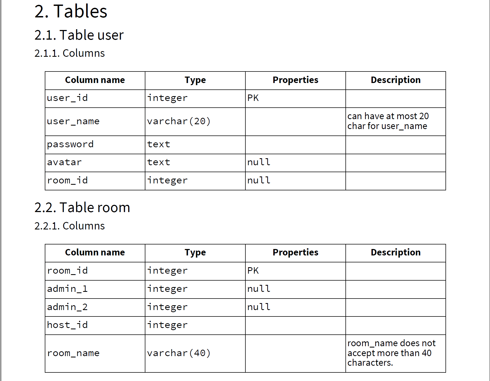
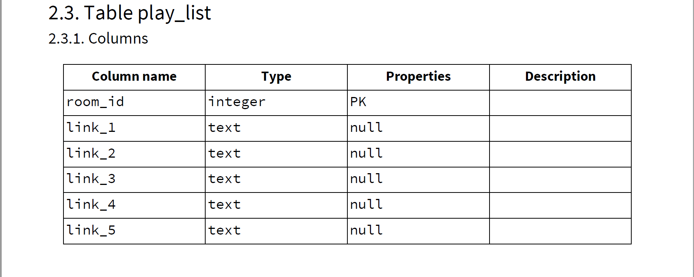
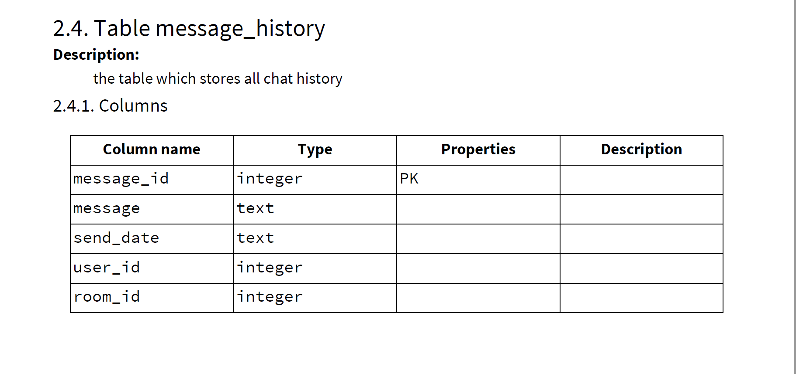
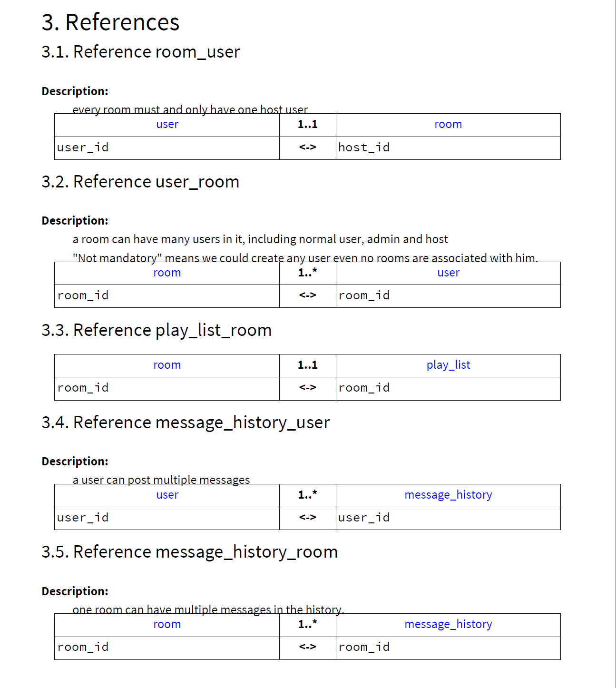

# README

# HYHYH

## Project Vision
Build a web service that allows a user to post interesting videos/clips that he or she would like to watch with other people. The videos source may come from a link on Youtube or upload by users themselves. Other users could choose a video post that they are interested in and watch that video simultaneously with others. The video is synchronized for everyone who is watching, and it means that if it is paused then all users who are watching would see a paused video/clip. In the mean time, there is a chat room for those people who are watching the same video. 

## Database

## Setup Guide
This README would normally document whatever steps are necessary to get the
application up and running.

Things you may want to cover:

* Ruby version

* System dependencies

* Configuration

* Database creation

* Database initialization

* How to run the test suite

* Services (job queues, cache servers, search engines, etc.)

* Deployment instructions

* ...
<<<<<<< HEAD
=======

## Team Members

Haorui Jiang [@hjiang00](https://github.com/hjiang00)

Haowen Zhang [@aimsecond](https://github.com/aimsecond)

Yulin Ou [@Lavden](https://github.com/Lavden)

Yichen Zhou [@sOsBiggestFan](https://github.com/sOsBiggestFan)

>>>>>>> 3003dd07fd84f31fc5e36b823c5aa1d321a61787
